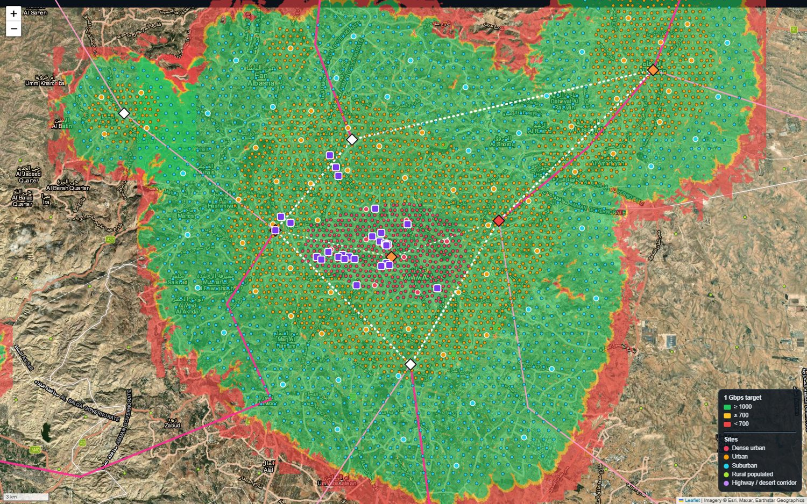
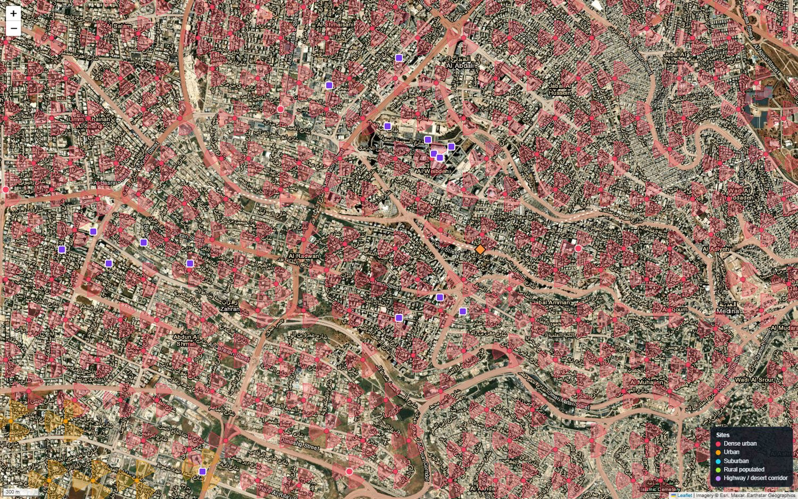
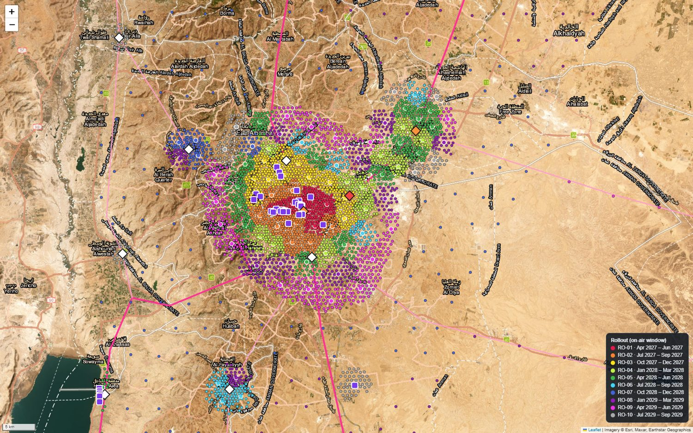
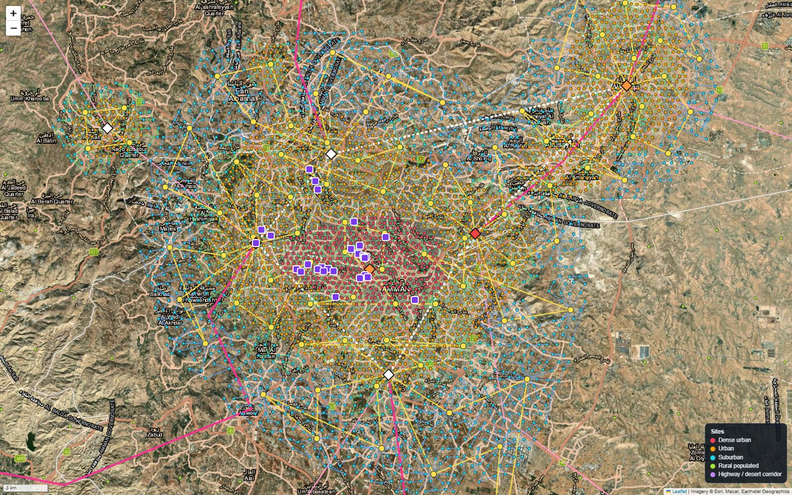

# Jordan 5G SA – Nationwide Network Design 🇯🇴📡

A complete, reproducible **nominal design of a greenfield 5G Standalone network for Jordan**, built on real terrain and real building heights, with one hard target: **1 Gbps for a single user anywhere in urban and suburban areas**.

**🗺️ Interactive map:** https://ajisrawi.github.io/jordan-5g-design/ &nbsp;·&nbsp; **📄 [Design report (PDF)](5G_Jordan_Design_Report.pdf)** &nbsp;·&nbsp; **🛠️ [Low-level design (PDF)](lld/Jordan_5G_Low_Level_Design.pdf)** &nbsp;·&nbsp; **🗓️ [Deployment plan (PDF)](deployment/Jordan_5G_Deployment_Plan.pdf)**


*Amman: terrain-aware single-user throughput prediction. Green ≥ 1 Gbps, amber 0.7–1 Gbps, red below.*

## What is in the design

| Area | Result |
|---|---|
| Radio network | **6,270 sites / 18,675 sectors** – dense urban 375 m grid, urban 450 m, suburban 650 m, rural 4.5 km, highways 7 km |
| Antenna plan | 3 sectors at 30° / 150° / 270° (2 along the road on highways), antenna height from building heights, **tilt per sector from terrain**, cell IDs – all in `output/sectors.csv` |
| Frequency plan | 700 MHz (coverage) + 1800 / 2100 MHz + **3 × 100 MHz at 3.5 GHz (the 1 Gbps layer)** + 26 GHz hotspots |
| 1 Gbps result | **≈ 96–98 % of outdoor locations ≥ 1 Gbps** with 300 MHz at busy-hour load; ≈ 78 % with 200 MHz; not achievable with 100 MHz |
| Fiber & transport | ≈ 8,900 km of fiber: 849 access rings, 41 aggregation rings, Amman metro ring, two national DWDM rings; 360 rural sites on microwave |
| Core | 2 geo-redundant core data centres in Amman + edge sites in Amman Centre, Zarqa, Irbid, Aqaba; ≈ 2.5 Tbps busy hour |
| Indoor | 51 malls, hotels, airports, hospitals and campuses: ≈ 5,340 indoor radio units + 196 mmWave heads |
| Equipment (LLD) | Per-site radio, baseband, power and battery; per-hub baseband pools; core function sizing and servers; router ports, DWDM wavelengths, microwave link budgets with terrain line-of-sight |
| Deployment | **10 rollouts over 36 months**, site-by-site allocation, bill of quantities, schedule, resources, risks |


*Central Amman at street level: sites moved onto local high points, three sectors each; squares are indoor venues.*

## Why terrain and buildings matter
Amman is built on hills and out of stone. The design therefore uses:
- **Copernicus GLO-90 elevation model** – sites are nudged onto the local high point, every sector gets its own tilt from the ground it looks at, every prediction includes terrain blocking, and every microwave hop is checked for line of sight.
- **GHSL building heights (EU JRC)** – antennas clear the tallest nearby roof by 8 m, rooftop vs monopole is decided per site, and sites in empty land are removed.

## Main finding
The network is limited by interference from neighbouring cells, not by signal strength. **1 Gbps per user is a question of bandwidth and cell load, not power:** it needs about 300 MHz of 3.5 GHz spectrum and busy-hour cell load kept near 10 %. The reports show the numbers for 100, 200 and 300 MHz.


*Deployment sequence for Amman–Zarqa: inside-out from the dense core (rollout 1) to the suburban ring (rollouts 9–10).*

## Repository layout
```
index.html, app.js, data/      interactive Leaflet map (satellite base, coverage, sites, fiber, indoor, rollout)
5G_Jordan_Design_Report.md/pdf design report: coverage, capacity, antennas, spectrum, transport, core, indoor
output/                        sites.csv, sectors.csv (azimuth / tilt / cell ID), fiber_rings.csv, hubs.csv, indoor_venues.csv, summary.json
lld/                           low-level design: RAN equipment, core sizing, transport (ports, DWDM, microwave) + CSVs + workbook
deployment/                    master plan, schedule, 10 work packages, resources, risks, BoQ, workbook, PDF
tools/                         Python generators (everything above is reproducible)
```

## Reproduce it
```bash
pip install numpy shapely tifffile imagecodecs pillow openpyxl markdown
python tools/generate_design.py      # sites, sectors, fiber, coverage rasters (downloads ~210 MB of open DEM / building data on first run)
python tools/lld_design.py           # equipment-level design
python tools/deployment_plan.py && python tools/deployment_docs.py
python tools/make_pdf.py             # PDFs (needs Chrome)
python -m http.server 8765           # then open http://localhost:8765
```
All planning inputs – service zones, site spacing, spectrum, traffic per user, equipment capacities, programme start date – are constants at the top of the scripts.


*Amman transport: access rings (green / blue), 100GE aggregation rings (yellow), hubs, metro core and backbone.*

## Limits – please read
- This is **nominal planning**, not a build-ready design. Predictions use 3GPP statistical path-loss models plus terrain diffraction; they are **not calibrated with drive tests**, and they are median values.
- **Spectrum holdings are an assumption.** Per-operator assignments in Jordan are not public; 300 MHz at 3.5 GHz for one network implies a shared or wholesale arrangement.
- Equipment capacities and power figures are **typical vendor-neutral values**, not quotes. Venue coordinates and floor areas are estimates. Crew productivity figures are planning norms.
- It is an independent engineering study and is not affiliated with any operator or regulator.

## Data credits
Copernicus DEM © ESA / DLR / Airbus · GHSL building heights © European Commission JRC (CC BY 4.0) · geoBoundaries (CC BY) · map imagery © Esri and its providers · propagation models 3GPP TR 38.901, ITU-R P.526 / P.530 / P.838.
