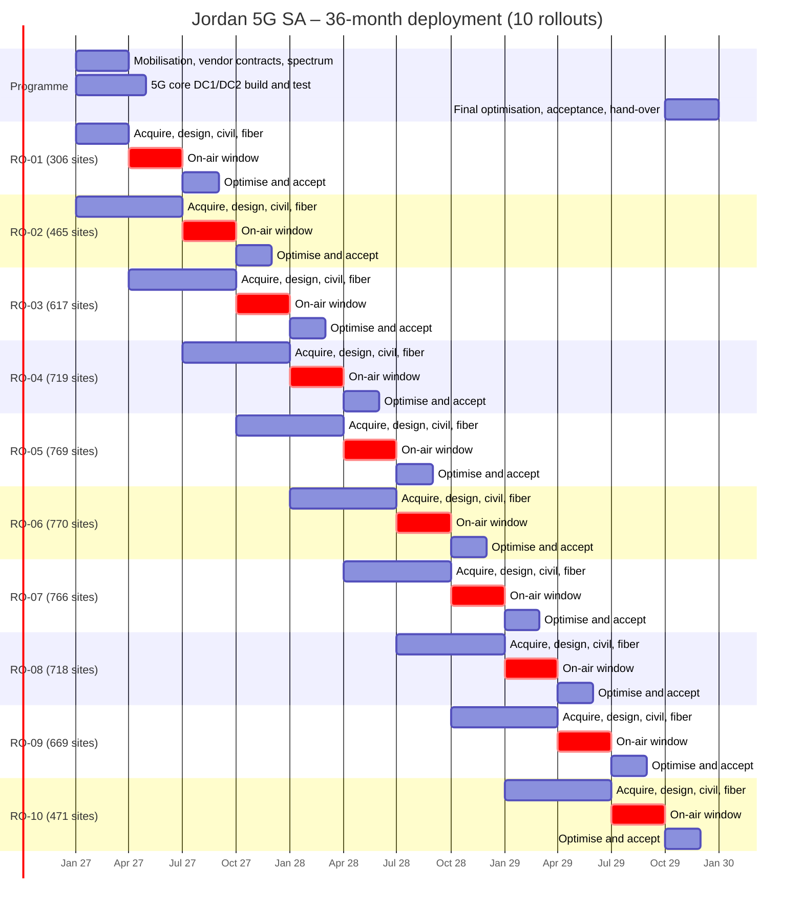

# Jordan 5G SA – Master Deployment Plan
**10 rollouts · 36 months · 6,270 macro sites · 18,675 sectors · ≈ 8,891 km fiber · 51 indoor venues**

Programme month 1 (M1) is assumed to be **January 2027**; all dates shift with the actual contract-effective date (`START` in `tools/deployment_plan.py`). This plan implements the nominal design in `5G_Jordan_Design_Report.md`; all quantities are generated from it and regenerate with `python tools/deployment_plan.py && python tools/deployment_docs.py`.

## Document set
| # | Document | Purpose |
|---|---|---|
| 00 | Master Deployment Plan (this file) | Strategy, sequencing, schedule, governance |
| 01 | `01_Programme_Schedule.md` | Month-by-month schedule, milestones, stage gates |
| 02 | `02_Transport_and_Core_Deployment.md` | Core, backbone, hub and ring build sequence |
| 03 | `03_Site_Implementation_Standard.md` | Site process from survey to acceptance, checklists, 1 Gbps acceptance test |
| 04 | `04_Indoor_Deployment_Plan.md` | Venue programme by rollout |
| 05 | `05_Resource_and_Procurement_Plan.md` | Crews, lead times, logistics, call-off calendar |
| 06 | `06_Risk_Register.md` | Risks, owners, mitigations |
| LLD | `../lld/LLD-01…03` | Equipment-level design: RAN, core, transport (ports, DWDM, microwave) |
| RO | `RO-01 … RO-10_Work_Package.md` | One work package per rollout: scope, BoQ, prerequisites, dates, exit criteria |
| Data | `Jordan_5G_Deployment_Plan.xlsx`, `rollout_sites.csv`, `rollout_boq.csv`, `rollout_schedule.csv`, `rollout_venues.csv` | Site-level allocation, bill of quantities, Gantt |
| Map | `index.html` → layer “Rollout phase” + rollout slider | Cumulative build on the satellite map |

## 1. Deployment strategy
1. **Build unit = one hub cluster** (DU hotel / pre-aggregation hub with all its access rings, ≈ 40 sites). Fiber, hub and radio sites of a unit are always in the same rollout, so no site waits for transport and no ring is left open.
2. **Value first, inside-out.** Units are ranked by service class (dense urban > urban > suburban), strategic weight (Amman–Zarqa metro, Irbid, Aqaba gateway, Dead Sea and Petra tourism) and distance from the city centre. Each city therefore grows as a contiguous 1 Gbps island – no isolated sites with a poor-SINR edge.
3. **Transport leads radio.** A unit cannot start before the backbone route feeding its city is lit (see 02). Highway sites go on air one rollout after their route, using the backbone add/drop points.
4. **Ramp, plateau, taper.** 306 → 465 → 617 sites in the first three rollouts while teams, logistics and processes mature, a plateau of ≈ 720–770 sites per rollout (≈ 250 per month) through RO-04…RO-08, taper in RO-09/10 when work moves to distant, low-density areas.
5. **Rural and highway coverage is not left to the end.** National highway corridors go on air one rollout after their backbone route (from RO-04); rural packages start in RO-07 so coverage obligations are met before programme close.
6. **Indoor follows macro by one rollout** so the donor/neighbour layer exists when a venue is integrated; landmark venues (QAIA, Abdali, major malls and 5-star hotels) start in RO-02.
7. **Every rollout ends with a formal cluster acceptance** against the 1 Gbps KPI (03 §6) before commercial launch in that area.

## 2. The ten rollouts
| Rollout | On-air window | Sites | DU | U | SU | Rural | Hwy | Hubs | Access + agg fiber km | Backbone km | Indoor venues | Cum. sites | Cum. pop. covered | Cum. 1 Gbps km² | Main areas |
|---|---|---|---|---|---|---|---|---|---|---|---|---|---|---|---|
| **RO-01** | Apr 2027 – Jun 2027 | 306 | 293 | 13 | 0 | 0 | 0 | 6 | 260 | 87 | 0 | 306 | 8.6 % | 40 | Amman-Zarqa Metro |
| **RO-02** | Jul 2027 – Sep 2027 | 465 | 176 | 289 | 0 | 0 | 0 | 10 | 445 | 194 | 18 | 771 | 18.4 % | 117 | Amman-Zarqa Metro, Irbid |
| **RO-03** | Oct 2027 – Dec 2027 | 617 | 8 | 589 | 20 | 0 | 0 | 15 | 645 | 340 | 5 | 1,388 | 28.5 % | 236 | Amman-Zarqa Metro, Aqaba, Irbid |
| **RO-04** | Jan 2028 – Mar 2028 | 719 | 0 | 625 | 61 | 0 | 33 | 16 | 719 | 337 | 14 | 2,107 | 39.3 % | 376 | Amman-Zarqa Metro, Irbid, Aqaba, Desert Highway (R15) Amman-Aqaba |
| **RO-05** | Apr 2028 – Jun 2028 | 769 | 0 | 561 | 176 | 0 | 32 | 19 | 806 | 278 | 1 | 2,876 | 50.1 % | 550 | Amman-Zarqa Metro, Wadi Musa / Petra, Irbid, Dead Sea - Wadi Araba (R65) Amman-Aqaba |
| **RO-06** | Jul 2028 – Sep 2028 | 770 | 0 | 455 | 308 | 0 | 7 | 19 | 916 | 174 | 9 | 3,646 | 60.3 % | 755 | Irbid, Amman-Zarqa Metro, Madaba, Mafraq |
| **RO-07** | Oct 2028 – Dec 2028 | 766 | 0 | 264 | 191 | 311 | 0 | 13 | 516 | 185 | 0 | 4,412 | 73.9 % | 878 | Jerash, Ma'an, Salt, Mafraq |
| **RO-08** | Jan 2029 – Mar 2029 | 718 | 0 | 166 | 415 | 126 | 11 | 18 | 774 | 471 | 2 | 5,130 | 83.4 % | 1,071 | Amman-Zarqa Metro, Ajloun, Amman governorate (rural), Salt |
| **RO-09** | Apr 2029 – Jun 2029 | 669 | 0 | 2 | 609 | 7 | 51 | 17 | 885 | 0 | 0 | 5,799 | 88.9 % | 1,309 | Amman-Zarqa Metro, Irbid, Mafraq-Safawi-Ruwaished (R10), Zarqa-Azraq-Safawi |
| **RO-10** | Jul 2029 – Sep 2029 | 471 | 0 | 6 | 465 | 0 | 0 | 17 | 659 | 0 | 2 | 6,270 | 93.0 % | 1,491 | Amman-Zarqa Metro, Irbid, Mutah-Mazar, Aqaba |

*Cumulative population = share of Jordan’s population living inside the footprint built so far (design-model estimate).*

**Year 1 (2027, RO-01…RO-03): 1,388 sites.** Core live in M3–M4; all of dense-urban Amman and Irbid core, inner urban Amman, Aqaba city; northern backbone ring and Desert Highway lit. ≈ 28.5 % of population covered.
**Year 2 (2028, RO-04…RO-07): 3,024 sites.** Remaining urban Amman, Zarqa, Russeifa, Irbid; most governorate capitals (Ajloun and the last Salt/Madaba clusters follow in RO-08); Dead Sea and Petra; southern backbone ring closed; national highways; first rural packages. ≈ 73.9 %.
**Year 3 (2029, RO-08…RO-10): 1,858 sites.** Suburban rings, remaining rural, eastern desert corridors, n258 hotspot layer in dense urban, indoor phase completion, network-wide optimisation and hand-over. 93.0 %.

## 3. Timeline

Each rollout runs the same 10-month pipeline, overlapping with its neighbours (three to four rollouts are always in flight):

| Offset from on-air start (T) | Activity |
|---|---|
| T−6 … T−3 | Nominal release, technical site surveys (TSSR), acquisition, permits |
| T−5 … T−3 | Detailed RF and transport design freeze, material call-off |
| T−4 … T−1 | Civil works, power, fiber to hubs and rings |
| T−2 … T | Hub / DU-hotel and router commissioning |
| T−1 … T+2 | Radio installation, commissioning, integration to 5GC |
| T … T+2 | Single-site verification |
| T+1 … T+4 | Cluster optimisation and acceptance |
| T+3 … T+4 | Commercial launch of the area, hand-over to operations |

RO-01 is compressed (acquisition starts in M1): it must use **existing rooftops and towers under sharing agreements** – this is the first critical-path item.

## 4. Critical path and prerequisites
| # | Prerequisite | Needed by | Owner |
|---|---|---|---|
| 1 | Spectrum licence: n78 3×100 MHz, n28, n1/n3, n258; type approval | M1 (RO-01 radios ordered against exact carrier plan) | Regulatory |
| 2 | RAN / core / transport vendor contracts, frame pricing, delivery SLAs | M1 | Procurement |
| 3 | Tower-company / operator site-sharing and dark-fiber framework agreements | M1–M2 | Commercial |
| 4 | DC1 and DC2 ready (power, cooling, cloud platform), 5GC + IMS integrated, first call | M3–M4 | Core |
| 5 | Amman metro core ring and first 6 hubs lit | M3 | Transport |
| 6 | Municipality (GAM, ASEZA, municipalities) master permit / fast-track process, EMF compliance procedure | M2 | Site acquisition |
| 7 | Power utility (JEPCO / IDECO / EDCO) connection framework | M2 | Civil |
| 8 | Northern backbone ring (RO-02), Desert Highway (RO-03), Wadi Araba – Dead Sea (RO-04) | start of the named rollout | Transport |
| 9 | Cross-border coordination for 109 flagged sectors | before the affected rollout goes on air | Regulatory |
| 10 | 3-CC n78 capable devices / CPE in the market | commercial launch RO-01 (M7) | Marketing |

## 5. Governance
* **Programme board** (monthly): sponsor, CTO, CFO, vendor executives – budget, stage gates, scope changes.
* **PMO** (weekly): rollout managers (one per active rollout), streams for Acquisition, Civil, Transport, RAN, Core, Indoor, Optimisation, HSE/Quality, Logistics.
* **Stage gates per rollout:** G1 design freeze (T−3) · G2 ready-for-installation ≥ 80 % sites (T−1) · G3 on-air ≥ 95 % (T+3) · G4 cluster acceptance (T+4) · G5 hand-over to operations.
* **RACI (summary):** operator – accountable for spectrum, acquisition approvals, acceptance; RAN vendor – responsible for install, commissioning, SSV, optimisation; transport contractor – fiber and routers; tower-co – passive infrastructure; PMO – integrated schedule and reporting.
* **Reporting KPIs:** sites acquired / RFI / installed / on-air / accepted vs plan (weekly S-curve per rollout), fiber km built, first-time-right install rate (target ≥ 92 %), SSV pass rate, % drive-test bins ≥ 1 Gbps, LTIFR, material availability ≥ 98 % at call-off.

## 6. Peak resources (see 05)
Peak in RO-05…RO-07: ≈ 37 radio install crews, 278 civil crews, 78 urban fiber crews, 22 acquisition agents, 5 SSV teams and 6 optimisation teams; peak build rate ≈ 257 sites/month and ≈ 310 km of access fiber per month.

## 7. Planning assumptions
* ≥ 50 % of urban sites reuse existing rooftops/towers (sharing) – without this the acquisition lead time moves from 3 to 6–9 months and RO-01…RO-03 slip by one quarter.
* Backbone: leased / swapped dark fiber (existing national OPGW and operator routes) is acceptable for first light; own-build follows within the same rollout year.
* Working calendar 22 days/month; Ramadan and summer-heat productivity factor 0.85 applied to Q2 rollouts in the resource plan buffer.
* Quantities come from a nominal design: expect ±10 % on site count after surveys; each work package is re-baselined at gate G1.
