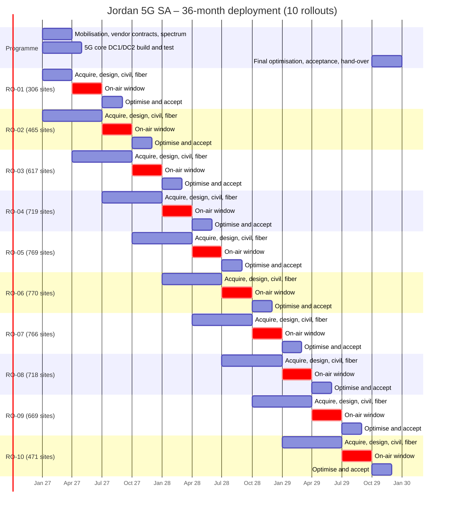

# 01 – Programme Schedule (36 months, 10 rollouts)

## Month-by-month milestones
| Month | Date | Milestones |
|---|---|---|
| M1 | Jan 2027 | Contract effective; PMO mobilised; RO-01 acquisition starts; long-lead orders placed; RO-01 gate G1 design freeze, material call-off |
| M2 | Feb 2027 | Sharing and dark-fiber frameworks signed; warehouse operational (Amman) |
| M3 | Mar 2027 | DC1/DC2 ready; metro core ring lit; first hubs commissioned |
| M4 | Apr 2027 | 5GC + IMS first call; **first site on air**; RO-01 on-air window opens (306 sites); RO-02 gate G1 design freeze, material call-off; RO-03 nominal release, surveys and acquisition start |
| M5 | May 2027 | – |
| M6 | Jun 2027 | – |
| M7 | Jul 2027 | **Commercial launch – Amman core** (RO-01 accepted); RO-01 gate G3 (≥ 95 % on air); RO-02 on-air window opens (465 sites); RO-03 gate G1 design freeze, material call-off; RO-04 nominal release, surveys and acquisition start |
| M8 | Aug 2027 | RO-01 cluster acceptance G4 / area launch |
| M9 | Sep 2027 | – |
| M10 | Oct 2027 | RO-02 gate G3 (≥ 95 % on air); RO-03 on-air window opens (617 sites); RO-04 gate G1 design freeze, material call-off; RO-05 nominal release, surveys and acquisition start |
| M11 | Nov 2027 | RO-02 cluster acceptance G4 / area launch |
| M12 | Dec 2027 | Year-1 close: Amman/Irbid dense urban + Aqaba on air; Desert Highway backbone lit |
| M13 | Jan 2028 | RO-03 gate G3 (≥ 95 % on air); RO-04 on-air window opens (719 sites); RO-05 gate G1 design freeze, material call-off; RO-06 nominal release, surveys and acquisition start |
| M14 | Feb 2028 | RO-03 cluster acceptance G4 / area launch |
| M15 | Mar 2028 | Southern backbone ring closed (Wadi Araba – Dead Sea) |
| M16 | Apr 2028 | RO-04 gate G3 (≥ 95 % on air); RO-05 on-air window opens (769 sites); RO-06 gate G1 design freeze, material call-off; RO-07 nominal release, surveys and acquisition start |
| M17 | May 2028 | RO-04 cluster acceptance G4 / area launch |
| M18 | Jun 2028 | Half-way: ≥ 50 % population covered |
| M19 | Jul 2028 | RO-05 gate G3 (≥ 95 % on air); RO-06 on-air window opens (770 sites); RO-07 gate G1 design freeze, material call-off; RO-08 nominal release, surveys and acquisition start |
| M20 | Aug 2028 | RO-05 cluster acceptance G4 / area launch |
| M21 | Sep 2028 | – |
| M22 | Oct 2028 | RO-06 gate G3 (≥ 95 % on air); RO-07 on-air window opens (766 sites); RO-08 gate G1 design freeze, material call-off; RO-09 nominal release, surveys and acquisition start |
| M23 | Nov 2028 | RO-06 cluster acceptance G4 / area launch |
| M24 | Dec 2028 | Year-2 close: urban layer of all major cities on air, rural programme started |
| M25 | Jan 2029 | RO-07 gate G3 (≥ 95 % on air); RO-08 on-air window opens (718 sites); RO-09 gate G1 design freeze, material call-off; RO-10 nominal release, surveys and acquisition start |
| M26 | Feb 2029 | RO-07 cluster acceptance G4 / area launch |
| M27 | Mar 2029 | – |
| M28 | Apr 2029 | n258 hotspot layer starts (dense urban); RO-08 gate G3 (≥ 95 % on air); RO-09 on-air window opens (669 sites); RO-10 gate G1 design freeze, material call-off |
| M29 | May 2029 | RO-08 cluster acceptance G4 / area launch |
| M30 | Jun 2029 | – |
| M31 | Jul 2029 | RO-09 gate G3 (≥ 95 % on air); RO-10 on-air window opens (471 sites) |
| M32 | Aug 2029 | RO-09 cluster acceptance G4 / area launch |
| M33 | Sep 2029 | **Last site on air** |
| M34 | Oct 2029 | RO-10 gate G3 (≥ 95 % on air) |
| M35 | Nov 2029 | RO-10 cluster acceptance G4 / area launch |
| M36 | Dec 2029 | Final acceptance, as-built documentation, hand-over to operations; programme close |

## S-curve (cumulative sites on air at end of each window)
| Rollout | End of window | Cumulative sites | % of programme | Cum. population covered |
|---|---|---|---|---|
| RO-01 | Jun 2027 | 306 | 5 % | 8.6 % |
| RO-02 | Sep 2027 | 771 | 12 % | 18.4 % |
| RO-03 | Dec 2027 | 1,388 | 22 % | 28.5 % |
| RO-04 | Mar 2028 | 2,107 | 34 % | 39.3 % |
| RO-05 | Jun 2028 | 2,876 | 46 % | 50.1 % |
| RO-06 | Sep 2028 | 3,646 | 58 % | 60.3 % |
| RO-07 | Dec 2028 | 4,412 | 70 % | 73.9 % |
| RO-08 | Mar 2029 | 5,130 | 82 % | 83.4 % |
| RO-09 | Jun 2029 | 5,799 | 92 % | 88.9 % |
| RO-10 | Sep 2029 | 6,270 | 100 % | 93.0 % |

## Activity schedule per rollout
| Rollout | Activity | Start | End |
|---|---|---|---|
| RO-01 | Nominal release, TSSR surveys, site acquisition & permits | M1 Jan 2027 | M1 Jan 2027 |
| RO-01 | Detailed RF / transport design freeze, material call-off | M1 Jan 2027 | M1 Jan 2027 |
| RO-01 | Civil works, power, fiber build to hubs and rings | M1 Jan 2027 | M3 Mar 2027 |
| RO-01 | Hub / DU-hotel and router commissioning | M2 Feb 2027 | M4 Apr 2027 |
| RO-01 | Radio install, commissioning, integration to 5GC | M3 Mar 2027 | M6 Jun 2027 |
| RO-01 | Single-site verification (SSV) | M4 Apr 2027 | M6 Jun 2027 |
| RO-01 | Cluster optimisation & acceptance (1 Gbps drive test) | M5 May 2027 | M8 Aug 2027 |
| RO-01 | Commercial launch of rollout area / hand-over to operations | M7 Jul 2027 | M8 Aug 2027 |
| RO-02 | Nominal release, TSSR surveys, site acquisition & permits | M1 Jan 2027 | M4 Apr 2027 |
| RO-02 | Detailed RF / transport design freeze, material call-off | M2 Feb 2027 | M4 Apr 2027 |
| RO-02 | Civil works, power, fiber build to hubs and rings | M3 Mar 2027 | M6 Jun 2027 |
| RO-02 | Hub / DU-hotel and router commissioning | M5 May 2027 | M7 Jul 2027 |
| RO-02 | Radio install, commissioning, integration to 5GC | M6 Jun 2027 | M9 Sep 2027 |
| RO-02 | Single-site verification (SSV) | M7 Jul 2027 | M9 Sep 2027 |
| RO-02 | Cluster optimisation & acceptance (1 Gbps drive test) | M8 Aug 2027 | M11 Nov 2027 |
| RO-02 | Commercial launch of rollout area / hand-over to operations | M10 Oct 2027 | M11 Nov 2027 |
| RO-03 | Nominal release, TSSR surveys, site acquisition & permits | M4 Apr 2027 | M7 Jul 2027 |
| RO-03 | Detailed RF / transport design freeze, material call-off | M5 May 2027 | M7 Jul 2027 |
| RO-03 | Civil works, power, fiber build to hubs and rings | M6 Jun 2027 | M9 Sep 2027 |
| RO-03 | Hub / DU-hotel and router commissioning | M8 Aug 2027 | M10 Oct 2027 |
| RO-03 | Radio install, commissioning, integration to 5GC | M9 Sep 2027 | M12 Dec 2027 |
| RO-03 | Single-site verification (SSV) | M10 Oct 2027 | M12 Dec 2027 |
| RO-03 | Cluster optimisation & acceptance (1 Gbps drive test) | M11 Nov 2027 | M14 Feb 2028 |
| RO-03 | Commercial launch of rollout area / hand-over to operations | M13 Jan 2028 | M14 Feb 2028 |
| RO-04 | Nominal release, TSSR surveys, site acquisition & permits | M7 Jul 2027 | M10 Oct 2027 |
| RO-04 | Detailed RF / transport design freeze, material call-off | M8 Aug 2027 | M10 Oct 2027 |
| RO-04 | Civil works, power, fiber build to hubs and rings | M9 Sep 2027 | M12 Dec 2027 |
| RO-04 | Hub / DU-hotel and router commissioning | M11 Nov 2027 | M13 Jan 2028 |
| RO-04 | Radio install, commissioning, integration to 5GC | M12 Dec 2027 | M15 Mar 2028 |
| RO-04 | Single-site verification (SSV) | M13 Jan 2028 | M15 Mar 2028 |
| RO-04 | Cluster optimisation & acceptance (1 Gbps drive test) | M14 Feb 2028 | M17 May 2028 |
| RO-04 | Commercial launch of rollout area / hand-over to operations | M16 Apr 2028 | M17 May 2028 |
| RO-05 | Nominal release, TSSR surveys, site acquisition & permits | M10 Oct 2027 | M13 Jan 2028 |
| RO-05 | Detailed RF / transport design freeze, material call-off | M11 Nov 2027 | M13 Jan 2028 |
| RO-05 | Civil works, power, fiber build to hubs and rings | M12 Dec 2027 | M15 Mar 2028 |
| RO-05 | Hub / DU-hotel and router commissioning | M14 Feb 2028 | M16 Apr 2028 |
| RO-05 | Radio install, commissioning, integration to 5GC | M15 Mar 2028 | M18 Jun 2028 |
| RO-05 | Single-site verification (SSV) | M16 Apr 2028 | M18 Jun 2028 |
| RO-05 | Cluster optimisation & acceptance (1 Gbps drive test) | M17 May 2028 | M20 Aug 2028 |
| RO-05 | Commercial launch of rollout area / hand-over to operations | M19 Jul 2028 | M20 Aug 2028 |
| RO-06 | Nominal release, TSSR surveys, site acquisition & permits | M13 Jan 2028 | M16 Apr 2028 |
| RO-06 | Detailed RF / transport design freeze, material call-off | M14 Feb 2028 | M16 Apr 2028 |
| RO-06 | Civil works, power, fiber build to hubs and rings | M15 Mar 2028 | M18 Jun 2028 |
| RO-06 | Hub / DU-hotel and router commissioning | M17 May 2028 | M19 Jul 2028 |
| RO-06 | Radio install, commissioning, integration to 5GC | M18 Jun 2028 | M21 Sep 2028 |
| RO-06 | Single-site verification (SSV) | M19 Jul 2028 | M21 Sep 2028 |
| RO-06 | Cluster optimisation & acceptance (1 Gbps drive test) | M20 Aug 2028 | M23 Nov 2028 |
| RO-06 | Commercial launch of rollout area / hand-over to operations | M22 Oct 2028 | M23 Nov 2028 |
| RO-07 | Nominal release, TSSR surveys, site acquisition & permits | M16 Apr 2028 | M19 Jul 2028 |
| RO-07 | Detailed RF / transport design freeze, material call-off | M17 May 2028 | M19 Jul 2028 |
| RO-07 | Civil works, power, fiber build to hubs and rings | M18 Jun 2028 | M21 Sep 2028 |
| RO-07 | Hub / DU-hotel and router commissioning | M20 Aug 2028 | M22 Oct 2028 |
| RO-07 | Radio install, commissioning, integration to 5GC | M21 Sep 2028 | M24 Dec 2028 |
| RO-07 | Single-site verification (SSV) | M22 Oct 2028 | M24 Dec 2028 |
| RO-07 | Cluster optimisation & acceptance (1 Gbps drive test) | M23 Nov 2028 | M26 Feb 2029 |
| RO-07 | Commercial launch of rollout area / hand-over to operations | M25 Jan 2029 | M26 Feb 2029 |
| RO-08 | Nominal release, TSSR surveys, site acquisition & permits | M19 Jul 2028 | M22 Oct 2028 |
| RO-08 | Detailed RF / transport design freeze, material call-off | M20 Aug 2028 | M22 Oct 2028 |
| RO-08 | Civil works, power, fiber build to hubs and rings | M21 Sep 2028 | M24 Dec 2028 |
| RO-08 | Hub / DU-hotel and router commissioning | M23 Nov 2028 | M25 Jan 2029 |
| RO-08 | Radio install, commissioning, integration to 5GC | M24 Dec 2028 | M27 Mar 2029 |
| RO-08 | Single-site verification (SSV) | M25 Jan 2029 | M27 Mar 2029 |
| RO-08 | Cluster optimisation & acceptance (1 Gbps drive test) | M26 Feb 2029 | M29 May 2029 |
| RO-08 | Commercial launch of rollout area / hand-over to operations | M28 Apr 2029 | M29 May 2029 |
| RO-09 | Nominal release, TSSR surveys, site acquisition & permits | M22 Oct 2028 | M25 Jan 2029 |
| RO-09 | Detailed RF / transport design freeze, material call-off | M23 Nov 2028 | M25 Jan 2029 |
| RO-09 | Civil works, power, fiber build to hubs and rings | M24 Dec 2028 | M27 Mar 2029 |
| RO-09 | Hub / DU-hotel and router commissioning | M26 Feb 2029 | M28 Apr 2029 |
| RO-09 | Radio install, commissioning, integration to 5GC | M27 Mar 2029 | M30 Jun 2029 |
| RO-09 | Single-site verification (SSV) | M28 Apr 2029 | M30 Jun 2029 |
| RO-09 | Cluster optimisation & acceptance (1 Gbps drive test) | M29 May 2029 | M32 Aug 2029 |
| RO-09 | Commercial launch of rollout area / hand-over to operations | M31 Jul 2029 | M32 Aug 2029 |
| RO-10 | Nominal release, TSSR surveys, site acquisition & permits | M25 Jan 2029 | M28 Apr 2029 |
| RO-10 | Detailed RF / transport design freeze, material call-off | M26 Feb 2029 | M28 Apr 2029 |
| RO-10 | Civil works, power, fiber build to hubs and rings | M27 Mar 2029 | M30 Jun 2029 |
| RO-10 | Hub / DU-hotel and router commissioning | M29 May 2029 | M31 Jul 2029 |
| RO-10 | Radio install, commissioning, integration to 5GC | M30 Jun 2029 | M33 Sep 2029 |
| RO-10 | Single-site verification (SSV) | M31 Jul 2029 | M33 Sep 2029 |
| RO-10 | Cluster optimisation & acceptance (1 Gbps drive test) | M32 Aug 2029 | M35 Nov 2029 |
| RO-10 | Commercial launch of rollout area / hand-over to operations | M34 Oct 2029 | M35 Nov 2029 |

The colour Gantt is in `Jordan_5G_Deployment_Plan.xlsx` (sheet “Schedule (Gantt)”).
